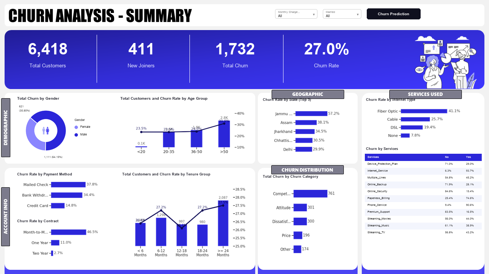
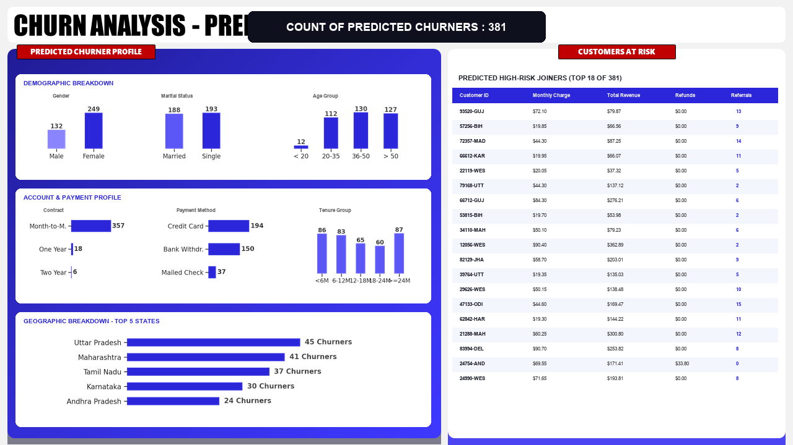

# 📊 End-to-End Telecom Customer Churn Analysis & Prediction

An end-to-end data analytics and machine learning portfolio project combining **Microsoft SQL Server (T-SQL)**, **Power BI (Power Query & DAX)**, and **Python (Scikit-Learn Random Forest Classifier)** to analyze historical telecom customer churn patterns and predict future churn risk for newly joined customers.


---

## 📌 Project Overview & Objectives

In competitive subscription-based industries like telecom, customer retention is vital for sustained revenue growth. This project builds a complete, production-grade business intelligence and predictive analytics solution to:

1. Profile Historical Churn: Analyze attrition patterns across demographic, geographic, financial, and service subscription dimensions.
2. Identify Root Causes: Pinpoint the primary drivers and categories behind customer departures.
3. Predict At-Risk Joiners: Train an ensemble Machine Learning model (**Random Forest**) to score newly acquired customers and flag those with high churn risk.
4. Empower Proactive Marketing: Equip commercial and retention teams with interactive dashboards and targeted customer contact lists.

---

## 📐 Architecture & Workflow

```mermaid
flowchart TD
    subgraph Data_Storage_and_ETL [Step 1: SQL Database & ETL]
        A["Raw Data (Customer_Data.csv)"] --> B["Staging Table (stg_Churn)"]
        B --> C["Data Profiling & Null Checks"]
        C --> D["Production Table (prod_Churn)"]
        D --> E1["vw_ChurnData (Stayed & Churned: 6,007 rows)"]
        D --> E2["vw_JoinData (New Joiners: 411 rows)"]
    end

    subgraph Power_BI_Transformations [Step 2 & 3: Power BI Data Model]
        D --> F1["prod_Churn (Churn Status, Monthly Charge Range)"]
        D --> F2["mapping_AgeGrp (Age Groups & Sorting)"]
        D --> F3["mapping_TenureGrp (Tenure Groups & Sorting)"]
        D --> F4["prod_Services (Unpivoted Service Columns)"]
        F1 & F2 & F3 & F4 --> G["DAX Measures (Total Customers, Churn Rate, etc.)"]
    end

    subgraph Machine_Learning [Step 5: Predictive Analytics (Python)]
        E1 --> H["Data Preprocessing & Label Encoding"]
        H --> I["Train/Test Split (80/20)"]
        I --> J["Random Forest Classifier (100 Trees)"]
        J --> K["Model Evaluation (Accuracy: 85%, Confusion Matrix)"]
        J --> L["Feature Importance Ranking"]
        E2 --> M["Batch Inference on New Joiners"]
        J & M --> N["Predictions.csv (381 Predicted Churners)"]
    end

    subgraph Dashboards [Step 4 & 6: Power BI Reporting]
        G --> O["Executive Summary Page & Tooltip Page"]
        N --> P["Churn Prediction Page (Actionable Grid & Demographics)"]
    end
```

---

## 📂 Repository Structure

```
telecom-churn-analysis/
├── .gitignore                          # Standard git ignore file
├── README.md                           # Comprehensive project documentation
├── requirements.txt                    # Python library dependencies
├── run_all.py                          # One-click end-to-end execution script
├── data/
│   ├── raw/
│   │   └── Customer_Data.csv           # Source dataset (6,418 customer records)
│   └── processed/
│       ├── db_Churn.sqlite             # Local SQLite database reproducing SQL Server
│       ├── prod_Churn.csv              # Cleaned production customer table
│       ├── vw_ChurnData.csv            # Historical records for training & analysis (6,007 rows)
│       ├── vw_JoinData.csv             # New joiners for batch scoring (411 rows)
│       ├── mapping_AgeGrp.csv          # Power BI Age group dimension table
│       ├── mapping_TenureGrp.csv       # Power BI Tenure group dimension table
│       ├── prod_Services.csv           # Unpivoted services table for service adoption
│       └── Predictions.csv             # 381 predicted at-risk joiners
├── sql/
│   ├── 01_create_database.sql          # T-SQL script to create db_Churn
│   ├── 02_data_exploration.sql         # T-SQL distinct value & NULL audit queries
│   ├── 03_etl_prod_churn.sql           # T-SQL ISNULL handling into prod_Churn
│   ├── 04_create_views.sql             # T-SQL view definitions for vw_ChurnData & vw_JoinData
│   └── run_sql_pipeline.py             # Cross-platform Python runner reproducing the SQL ETL
├── python/
│   ├── churn_prediction.py             # Random Forest training, evaluation & inference script
│   └── outputs/
│       ├── Predictions.csv             # Filtered predictions of joiners likely to churn
│       ├── feature_importances.png     # Saved feature importance chart
│       ├── evaluation_metrics.txt      # Confusion matrix & classification report
│       └── churn_rf_model.joblib       # Serialized model & label encoders
├── notebooks/
│   └── churn_prediction_model.ipynb    # Fully executed Jupyter Notebook with visual outputs
└── powerbi/
    ├── assets/
    │   ├── Summary.png                 # Full rendered Summary Dashboard (1280x720)
    │   ├── Prediction.png              # Full rendered Churn Prediction Dashboard (1280x720)
    │   ├── templates/                  # Canvas background templates
    │   │   ├── Summary_template.png
    │   │   └── Prediction_template.png
    │   └── icons/
    │       ├── Ico_Gender.png          # Visual gender icon 1
    │       └── Ico_Gender2.png         # Visual gender icon 2
    ├── dax_measures.dax                # All DAX calculations used across pages
    ├── power_query_transforms.m        # Power Query M code for tables & unpivoting
    └── dashboard_specification.md      # Detailed visual-by-visual layout & configuration guide
```

---

## 🛠️ Step 1: SQL Server Database & ETL

### 1.1 Database Creation & Staging Import
- Database created: `db_Churn`.
- CSV file imported into staging table `stg_Churn` via the SQL Server Import Flat File Wizard.
- `Customer_ID` designated as Primary Key; boolean indicator columns converted from `BIT` to `VARCHAR(50)` to ensure fault-tolerant data ingestion.

### 1.2 Data Exploration & Quality Checks
SQL queries run to inspect category distributions and check for NULL occurrences:
```sql
-- Check Status & Revenue breakdown
SELECT Customer_Status, COUNT(Customer_Status) AS TotalCount, SUM(Total_Revenue) AS TotalRev,
       SUM(Total_Revenue) / (SELECT SUM(Total_Revenue) FROM stg_Churn) * 100 AS RevPercentage
FROM stg_Churn
GROUP BY Customer_Status;
```

### 1.3 Data Cleaning & Production Table (`prod_Churn`)
Null values in supplementary services are replaced with standard defaults (`'No'`, `'None'`, or `'Others'`) using `ISNULL`:
```sql
SELECT 
    Customer_ID, Gender, Age, Married, State, Number_of_Referrals, Tenure_in_Months,
    ISNULL(Value_Deal, 'None') AS Value_Deal,
    Phone_Service,
    ISNULL(Multiple_Lines, 'No') AS Multiple_Lines,
    Internet_Service,
    ISNULL(Internet_Type, 'None') AS Internet_Type,
    ISNULL(Online_Security, 'No') AS Online_Security,
    ISNULL(Online_Backup, 'No') AS Online_Backup,
    ISNULL(Device_Protection_Plan, 'No') AS Device_Protection_Plan,
    ISNULL(Premium_Support, 'No') AS Premium_Support,
    ISNULL(Streaming_TV, 'No') AS Streaming_TV,
    ISNULL(Streaming_Movies, 'No') AS Streaming_Movies,
    ISNULL(Streaming_Music, 'No') AS Streaming_Music,
    ISNULL(Unlimited_Data, 'No') AS Unlimited_Data,
    Contract, Paperless_Billing, Payment_Method, Monthly_Charge,
    Total_Charges, Total_Refunds, Total_Extra_Data_Charges, Total_Long_Distance_Charges, Total_Revenue,
    Customer_Status,
    ISNULL(Churn_Category, 'Others') AS Churn_Category,
    ISNULL(Churn_Reason , 'Others') AS Churn_Reason
INTO [db_Churn].[dbo].[prod_Churn]
FROM [db_Churn].[dbo].[stg_Churn];
```

### 1.4 Segmented Views
- **`vw_ChurnData`**: Historical records (`Customer_Status IN ('Churned', 'Stayed')`) — **6,007 records**.
- **`vw_JoinData`**: Newly joined records (`Customer_Status = 'Joined'`) — **411 records**.

---

## 🔄 Step 2: Power BI Transformations (Power Query)

1. **Calculated Columns on `prod_Churn`**:
   - `Churn Status = if [Customer_Status] = "Churned" then 1 else 0` (Type: Whole Number).
   - `Monthly Charge Range = if [Monthly_Charge] < 20 then "< 20" else if [Monthly_Charge] < 50 then "20-50" else if [Monthly_Charge] < 100 then "50-100" else "> 100"`.
2. **Dimension Table `mapping_AgeGrp`**:
   - Distinct ages grouped into `< 20`, `20 - 35`, `36 - 50`, `> 50`.
   - `AgeGrpSorting` (1, 2, 3, 4) applied to guarantee logical visual sorting.
3. **Dimension Table `mapping_TenureGrp`**:
   - Distinct tenure months grouped into `< 6 Months`, `6-12 Months`, `12-18 Months`, `18-24 Months`, `>= 24 Months`.
   - `TenureGrpSorting` (1, 2, 3, 4, 5) applied for chronological ordering.
4. **Dimension Table `prod_Services`**:
   - Unpivots 11 service columns to two standardized columns: `Services` (Attribute) and `Status` (Value).

---

## 📈 Step 3: Power BI DAX Measures

```dax
// Summary Page Measures
Total Customers = COUNT(prod_Churn[Customer_ID])

New Joiners = CALCULATE(COUNT(prod_Churn[Customer_ID]), prod_Churn[Customer_Status] = "Joined")

Total Churn = SUM(prod_Churn[Churn Status])

Churn Rate = DIVIDE([Total Churn], [Total Customers], 0)

// Prediction Page Measures
Count Predicted Churner = COUNT(Predictions[Customer_ID]) + 0

Title Predicted Churners = "COUNT OF PREDICTED CHURNERS : " & COUNT(Predictions[Customer_ID])
```

---

## 🎨 Step 4: Power BI Visualizations — Summary Page



- **Canvas View**: `powerbi/assets/Summary.png` (1280x720 px)
- **Top KPI Cards**: Total Customers (6,418), New Joiners (411), Total Churn (1,732), Churn Rate (27.0%).
- **Demographics**:
  - Gender vs. Churn Rate (with gender indicator icons).
  - Age Group vs. Total Customers & Churn Rate (Dual-axis Line & Clustered Column).
- **Account & Financials**:
  - Payment Method vs. Churn Rate (Highest churn in Electronic Check / Bank Transfer).
  - Contract Type vs. Churn Rate (Month-to-month contracts exhibit significantly higher churn).
  - Tenure Group vs. Churn Rate (High churn concentrated in `< 6 Months`).
- **Geographic**: Top 5 States by Churn Rate.
- **Churn Distribution**: Churn Category bar chart with report-page drillthrough tooltip for **Churn Reason**.
- **Service Utilization**: Internet Type vs. Churn Rate and service breakdown.

---

## 🤖 Step 5: Machine Learning (Random Forest Classifier)

### Methodology:
1. **Target Variable**: Binary classification on `Customer_Status` (`Stayed: 0`, `Churned: 1`).
2. **Feature Preprocessing**:
   - Removed identifiers and leakage variables (`Customer_ID`, `Churn_Category`, `Churn_Reason`).
   - Categorical attributes encoded using `LabelEncoder`.
3. **Model**: `RandomForestClassifier(n_estimators=100, random_state=42)`.
4. **Validation**: 80/20 train/test split.

### Model Performance:
- **Overall Accuracy**: **85%**
- **Weighted F1-Score**: **0.85**
- **Confusion Matrix**:
  ```
  [[790   51]   <- True Stayed
   [125  236]]  <- True Churned
  ```
- **Classification Report**:
  - Class 0 (Stayed): Precision = 0.86, Recall = 0.94, F1 = 0.90
  - Class 1 (Churned): Precision = 0.82, Recall = 0.65, F1 = 0.73

### Batch Scoring on New Customers (`vw_JoinData`):
- Total New Joiners: **411**
- **Predicted At-Risk Churners**: **381** (Filtered where `Customer_Status_Predicted == 1` and exported to `Predictions.csv`).

---

## 🔮 Step 6: Power BI Churn Prediction Dashboard



- **Canvas View**: `powerbi/assets/Prediction.png` (1280x720 px)
- **Header KPI**: `COUNT OF PREDICTED CHURNERS : 381`
- **Right Customer Detail Grid**: Displays individual customer identifiers (`Customer_ID`), `Monthly_Charge`, `Total_Revenue`, `Total_Refunds`, and `Number_of_Referrals` for immediate intervention.
- **Demographic & Account Segmentations**: Breakdowns of predicted churners across Age Groups, Gender, Marital Status, Contract, and State.

---

## 🚀 How to Run the Project Locally

### 1. Prerequisites
- Python 3.9+ installed
- Git installed
- Power BI Desktop (optional, for viewing `.pbix` / building visuals)

### 2. Clone the Repository
```bash
git clone <your-repo-url> telecom-churn-analysis
cd telecom-churn-analysis
```

### 3. Install Dependencies
```bash
pip install -r requirements.txt
```

### 4. Run the Complete Pipeline (One Command)
```bash
python run_all.py
```

This single command will:
1. Execute the SQL ETL pipeline (profiling data, cleaning nulls, generating views and Power BI mapping tables).
2. Train the Random Forest machine learning model.
3. Save evaluation metrics and the feature importances plot to `python/outputs/`.
4. Perform batch scoring on newly joined customers and export `Predictions.csv` (381 records).

### 5. Run the Interactive Jupyter Notebook
```bash
jupyter notebook notebooks/churn_prediction_model.ipynb
```

---
